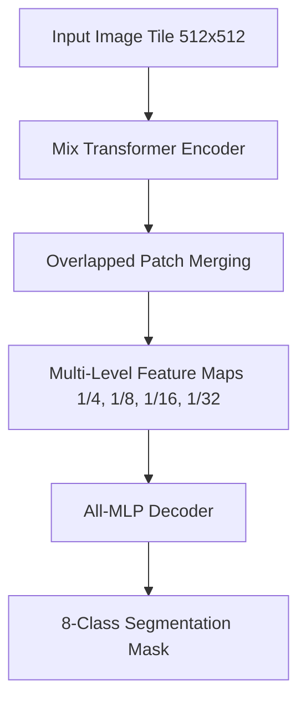

# Architecture & Model Design

GeoMorph AI departs from traditional Convolutional Neural Networks (CNNs) like U-Net and DeepLabV3 by utilizing a purely attention-based **SegFormer** architecture. Specifically, the pipeline is built on top of the HuggingFace `nvidia/mit-b0` backbone.

## The SegFormer Advantage
SegFormer features a hierarchical Transformer encoder that does not rely on positional encoding. This provides two massive advantages for geospatial imagery:
1. **Resolution Agnosticism**: It inherently adapts to the massive, varied resolutions of aerial imagery without hardcoded crop limitations.
2. **Global Receptive Field**: Unlike CNNs that are limited by kernel sizes (e.g., 3x3), SegFormer computes self-attention across the entire tile, allowing it to understand the context of a river relative to a distant road, rather than just local pixel textures.

## Model Flow

## The All-MLP Decoder
By utilizing an extremely lightweight All-MLP decoder, GeoMorph AI achieves rapid inference speeds (sub-second per tile) while maintaining state-of-the-art mIoU metrics, making it highly feasible for edge deployment.
