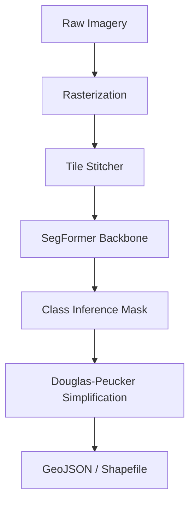

# Architecture

GeoMorph AI leverages a SegFormer transformer backbone for robust feature extraction and semantic segmentation.

```mermaid
graph TD
    A[Raw Imagery] --> B[Rasterization]
    B --> C[Tile Stitcher]
    C --> D[SegFormer Backbone]
    D --> E[Class Inference Mask]
    E --> F[Douglas-Peucker Simplification]
    F --> G[GeoJSON / Shapefile]
```